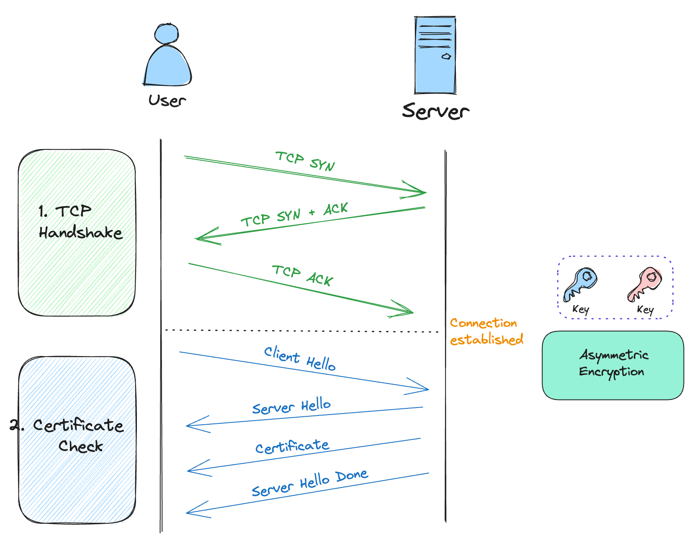

Here is what I wanna say: 

> So all these info isn't that hard to gather around, GPT does a good job on explaining all of this. I drew these illustration because I think that most people are vision-driven by the human nature.

### HTTP and HTTPS

Not much to say here, your browser will warn the hell out of you if you use HTTP without the `s` at the end.

### HTTP steps

Bascially 4 steps:
 1. TCH Handshake
 2. Certificate Check, one thing that's worth mentioning, is the client needs to know the server is who it says it is, they both need to have a trusted authority, the client is interacting with the actual owner of the domain.
 3. Key Exchange, public and private keys.
 4. Data Transmission 

### HTTP1

### HTTP2

### HTTP3